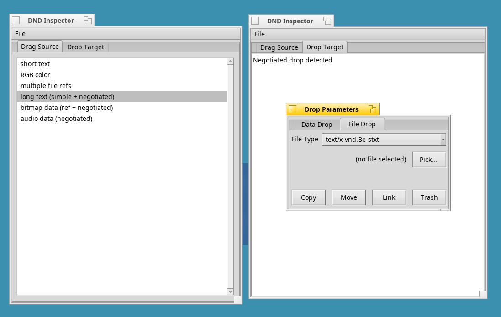

# dnd-inspect
DND inspector (source/target) for Haiku

A little utility to assist with testing your app's DnD functionality (both source and target).

**IMPORTANT!**
The program uses some testdata, and needs to be able to access the _testcontent/ directory from wherever you run it.

