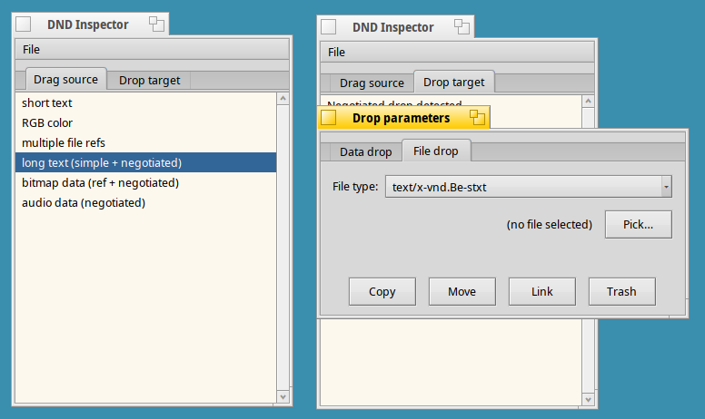

# dnd-inspect
DND inspector (source/target) for Haiku

A little utility to assist with testing your app's DnD functionality (both source and target).

**IMPORTANT!**
The program uses some testdata, and needs to be able to access a _testcontent/ directory from wherever you run it. So extract this archive in the same dir as the executable: [download link](https://www.dropbox.com/s/92kay78441cague/_testcontent.zip?dl=0)

